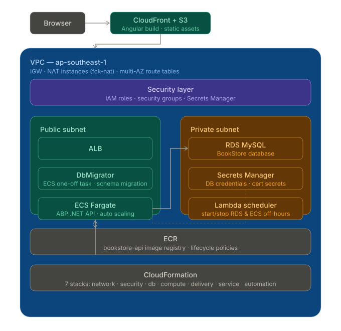
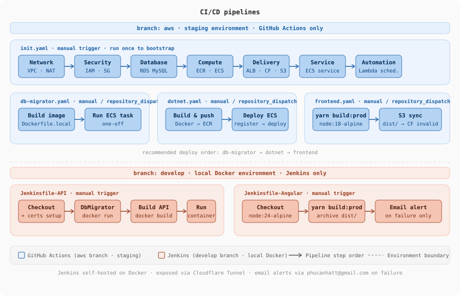

# ABP Framework — AWS Cloud Migration

> A full-stack web application built with ABP Framework, used as a realistic workload to explore production-grade AWS infrastructure and DevOps practices. The focus is **infrastructure and deployment** — not application features.


---

## What this project covers

The ABP BookStore app is containerized and deployed to AWS through a dual CI/CD pipeline — **GitHub Actions** for infrastructure, **Jenkins** for application — with all cloud resources managed as modular CloudFormation stacks.

---

## Architecture

### AWS infrastructure



### CI/CD pipeline



---

## Infrastructure stacks

All infrastructure is split into **7 independent CloudFormation stacks**, each owning a distinct layer. This makes updates safer and rollbacks scoped to a single concern.

| Stack | Resources |
|---|---|
| 🌐 **Network** | VPC, multi-AZ subnets, IGW, route tables, NAT instances |
| 🔒 **Security** | IAM roles, security groups, Secrets Manager |
| 🗄️ **Database** | RDS MySQL (private subnet) |
| ⚙️ **Compute** | ECR, ECS Cluster, task definitions |
| 🚀 **Delivery** | ALB, S3, CloudFront distribution |
| 📦 **App service** | ECS Fargate service + auto scaling |
| ⏰ **Automation** | Lambda scheduler — start/stop RDS & ECS off-hours |

---

## CI/CD pipelines

Two pipelines run independently for the API and Angular frontend:

| Pipeline | Trigger | What it does |
|----------|---------|-------------|
|  **Infrastructure** | Push to `aws` | Deploys 7 CloudFormation stacks in dependency order, pushes Docker images to ECR |
|  **Application** | Manual / webhook | Full app lifecycle — see steps below |

**Jenkins application pipeline (in order):**

| Step | What happens |
|------|-------------|
| 1️⃣ DbMigrator | Isolated ECS one-off task — applies schema migrations before API starts |
| 2️⃣ API | Builds Docker image, runs container with RSA certs mounted |
| 3️⃣ Angular | `yarn build:prod` inside `node:18-alpine`, syncs `dist/` to S3 |
| 4️⃣ Alerts | Email on failure via `post { failure }` — exposed via Cloudflare Tunnel |

---

## Key design decisions

| Decision | Why it matters |
|----------|---------------|
| 💰 **[fck-nat](https://github.com/AndrewGuenther/fck-nat) over NAT Gateway** | Cuts networking costs by **~85%** (~$30–35/month saved) — same HA behaviour, fraction of the price |
| 🔄 **Separate DbMigrator task** | Migrations run as an isolated ECS task before the API starts — atomic, auditable, and decoupled from the API container lifecycle |
| 🔐 **Secrets via CF output injection** | `DB_ENDPOINT`, `DB_USER`, `DB_PASSWORD` resolved from CloudFormation outputs at deploy time — no hardcoded values in the codebase |
| 📜 **OpenIddict cert management** | RSA signing + encryption certs stored as Jenkins credentials, mounted at runtime — no `.pfx` files committed to the repo |

---

## Tech stack


---

## Local development

**Prerequisites:** .NET 9 SDK · Node 18+ · Docker

```bash
# Install ABP client-side libs
abp install-libs

# Start all services (API + Angular + MySQL) via Docker Compose
docker-compose up

# Or run DB migrations standalone
dotnet run --project src/Acme.BookStore.DbMigrator
```

> For the OpenIddict signing certificate, generate a local `.pfx` with:
> ```bash
> dotnet dev-certs https -v -ep openiddict.pfx -p <your-password>
> ```

---

## Cost notes

This is a staging environment designed to minimize spend:

| Optimization | Saving |
|---|---|
| fck-nat instead of NAT Gateway | ~$30–35/month |
| Lambda uptime scheduler (off-hours shutdown) | ~40–50% of ECS + RDS cost |
| ECS Fargate (no idle EC2) | pay-per-use only |
